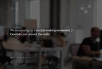

# HOW TO SETUP THIS PLUGIN

This plugin is designed to be reduced. It provides a number of best practices in the use of filters
and actions to integrate with the Disciple Tools system. I also offers a number of site starter sites
in order to rapid build a Disciple Tools "Front Porch".

A Disciple Tools porch is a plugin that places a micro site in front of a Disciple Tools system. It can be made as a single page
or multipage site with lead forms, sign up forms, and even a lightweight logged in experience for non-DT users. A porch can also
be used to cloak the presence of the Disciple Tools system, by hiding it behind a benign public page, for security sensitive implementations.
This porch can have direct integration or no integration with the Disciple Tools system running behind it.

The following are a list of the key steps you need to take to adapt this starter plugin for your projects use:

## 1. REFACTOR/RENAME

The plugin has been written so that with a couple find-and-replace tasks you can rename all the key classes,
ids, and domains inside the plugin to the names of the project you are working on. This is required.
Because Wordpress plugins integration directly in the the Wordpress/Disciple Tools system. It is possible
to have class name and function name collisions. You must refactor.

1.  Rename file name in the root folder called ```disciple-tools-porch-template.php```
1. find/replace string ```DiscipleTools/disciple-tools-porch-template```
1. find/replace string ```Porch Template```
1. find/replace string ```Disciple_Tools_Porch_Template```
1. find/replace string ```DT_Porch_Template```
1. find/replace string ```disciple-tools-porch-template```
1. find/replace string ```dt_porch_template```


## 2. REDUCE UNWANTED HOME STYLE FOLDERS

Review the different home styles in the folders labeled ```home-```. These can be turned on by a single line in the
root file ```disciple-tools-porch-template.php``` (or whatever you refactored it to be). The ```loader.php``` file in
the root of each home style will load all the elements needed to redirect the root URL and load the single page site.
You can find these around line 110, inside the ```__construct```.

```
        require_once( 'home-1/loader.php' ); /* Pray4Movement */
//        require_once( 'home-2/loader.php' ); /* Simple, Big images, White and Image */
//        require_once( 'home-3/loader.php'); /* Parallax, White/Green, thin sections, sticky top nav */
//        require_once( 'home-4/loader.php' ); /* Large sections, white/light blue, */
//        require_once( 'home-5/loader.php'); /* White/blue/grey, big sections, hover effects/animations */
//        require_once( 'home-6/loader.php'); /* greeen/white, simple, bold */
//        require_once( 'home-7/loader.php'); /* single image, full screen */
//        require_once( 'home-8/loader.php'); /* single looping video, full screen */

//        require_once( 'home-blank/loader.php'); /* blank setup. You can drop a single page site into this folder. */
```

If you comment out, ```home-1/loader.php``` and uncomment ```home-3/loader.php``` and refresh your dev site, you will
see the entire site has changed to ```home-3```.

At this point, if you were selecting ```home-3``` as your starter porch, you could delete all the other ```home-``` folders,
i.e. ```home-1, home-2, home-4, home-5, home-6, home-7, home-8, home-blank```. And delete all the uncommented lines in the
root ```disciple-tools-porch-template.php```.


## 3. REDUCE UNWANTED SITE SECTIONS

Following the previous example, location the ```body.php``` file inside the ```home-3``` folder. Basically, all site editing
can happen inside the ```body.php``` file.

 ```home-3``` has multiple sections (or panels) building the micro site from top to bottom. Most of these can be simply removed to simplify the site. For example, if you want a
site with just a top image, a content panel, and a contact form at the bottom (i.e. three sections), you would just delete every unwanted ```section```
started with ```probootstrap-section```.

```
<section class="probootstrap-section"><!-- remove from here -->
    <div class="container">
        <div class="row">
            ... (code) ...
            </div>
        </div>
    </div>
</section><!-- to here -->
```


---

In just a few minutes, you can refactor this plugin and reduce a starter site to be ready for you to add your unique messaging! Good luck!


## Screenshots

__Home-1__ (Pray4Movement example dark, large start image, animations)


__Home-2__ (Simple, Big images, White and Image)


__Home-3__ (Parallax, White/Green, thin sections, sticky top nav)


__Home-4__ (Large sections, white/light blue)


__Home-5__ (Big sections, hover effects/animations, color schemes: blue, teal, lightgreen, green, purple, orange)


__Home-6__ (simple, greeen/white, bold)


__Home-7__ (one page image)


__Home-8__ (one page background video)


